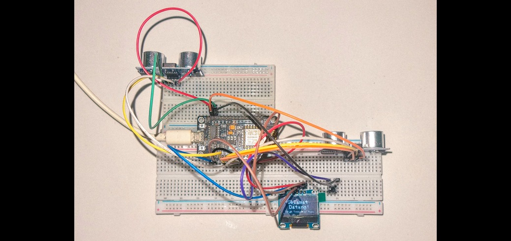
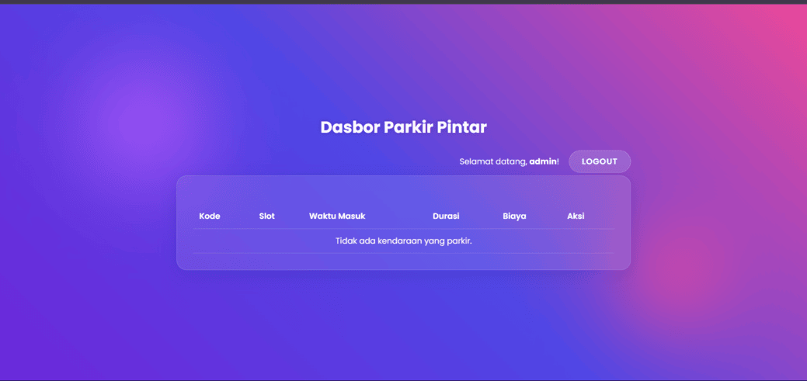

# IoT-Based Smart Parking System (Full-Stack Prototype)

A prototype end-to-end smart parking system that uses an IoT device (ESP8266) to detect slot availability and display it on a web dashboard in real-time. This project is designed to improve parking search efficiency for users and provide easy monitoring tools for administrators.

---

## 🖼️ System Interface Demo
The following is a brief overview of the Smart Parking System workflow, starting from ticket requests by users, confirmation via the web, to the checkout process by the admin.

| 1. Devices & Tickets on OLED                       | 2. Admin Dashboard (Data Entry)                        |
|:--------------------------------------------------:|:------------------------------------------------------:|
|  |  |

| 3. User Confirmation Page                          | 4. Success Status                                      |
|:--------------------------------------------------:|:------------------------------------------------------:|
|  |  |

---

## ✨ Main Features

- **Real-Time Slot Detection**
Uses ultrasonic sensors to accurately detect vehicle presence.

- **Smart Ticket System**
Generates a random unique code and suggests available parking slots via an OLED display.

- **Two-Way Communication**
IoT devices send and receive slot status data from the server to prevent double-booking.

- **Admin Dashboard**
Secured web interface with a login system to monitor parking slots, duration, and estimated costs in real-time (auto-refresh).

- **User Confirmation Page**
Users can confirm parking slots with a unique code and select available slots.

- **Backend Validation**
The server will reject confirmation if the slot has already been claimed by another user.

- **Session Management**
Admins can process vehicle exits, and the data will be automatically removed from the active list.

---

## 🛠️ Technology Used

| Category         | Technology                                                      |
|------------------|-----------------------------------------------------------------|
| Hardware (IoT)   | ESP8266 NodeMCU, Ultrasonic Sensor HC-SR04, OLED screen SSD1306 |
| Firmware         | C++ in the Arduino IDE environment                              |
| Backend          | PHP 8.x                                                         |
| Database         | MySQL / MariaDB                                                 |
| Frontend         | HTML5, CSS3, JavaScript (ES6)                                   |
| Local Environment| XAMPP (Apache Web Server)                                       |

---

## 🚀 Local Installation & Setup Guide

### Prerequisite

- Make sure **XAMPP** is installed and **Apache & MySQL** services are running.
- Make sure **Arduino IDE** with **ESP8266 Board Manager** is installed.

### Clone Repository

```bash
git clone https://github.com/aerial-fly/IoT-Based-Smart-Parking-System-Prototype.git
```
## Database Setup
1. Open phpMyAdmin.
2. Create a new database named db_parkir.
3. Import or run SQL queries to create the parkir_aktif and admin_users tables.
(The SQL files are available in the reports or documentation folder of the repo.)
4. Create an initial admin account in the admin_users table.

## Backend Configuration
1. In the /includes folder, copy the koneksi.example.php file and rename it to koneksi.php.
2. Open koneksi.php and adjust the configuration:
    $host = 'localhost';
    $user = 'root';
    $password = '';
    $dbname = 'db_parkir';

## Configuration & Firmware Upload
1. Open the .ino file with the Arduino IDE.
2. Adjust:
    const char* ssid = "WIFI_NAME";
    const char* password = "WIFI_PASSWORD";
    String serverName = "http://192.168.X.X/parkir-pintar/includes/";

3. Upload to your ESP8266 board.
   Run the application.
   Access via browser: http://localhost/parkir-pintar/public/login.html

## 📂 Folder Structure

```bash
/parkir-pintar
├── .gitignore
├── public/
│   ├── index.html
│   ├── login.html
│   ├── admin.php
│   ├── style.css
│   └── ... (files .js)
├── includes/
│   ├── koneksi.example.php
│   └── ... (all process .php files)
```

## 👤 Kontributor
Aerial
- Full-Stack & IoT Development
